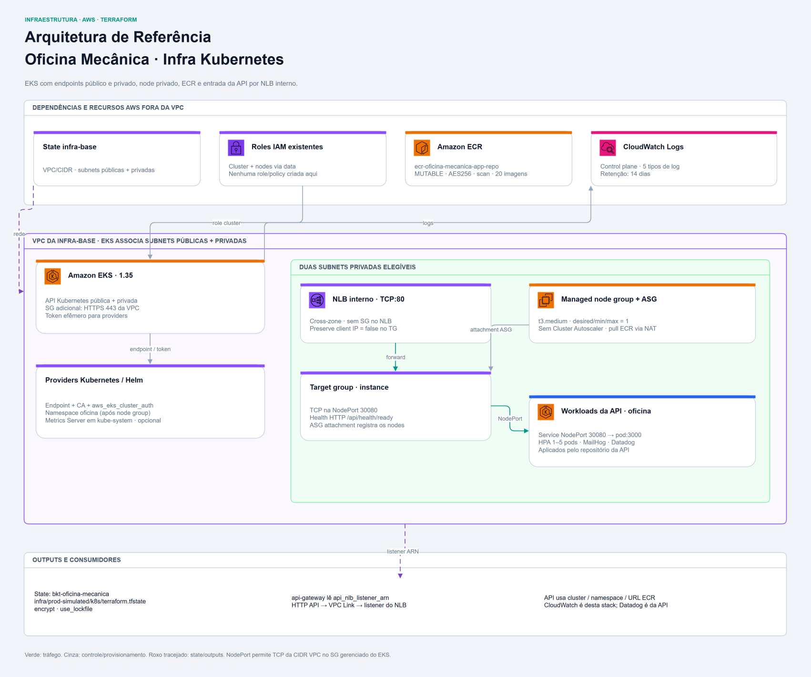

<div align="center">

# ☸️ Oficina Mecânica — Plataforma Kubernetes e Contêineres (IaC)

**Provisionamento e configuração do cluster EKS, Node Group, ECR e recursos de plataforma Kubernetes com Terraform e Helm para a solução Oficina Mecânica.**


</div>

## 📋 Sobre

Este repositório contém o código de **Infraestrutura como Código (IaC)** responsável pelo provisionamento do cluster **Amazon EKS**, **Managed Node Group**, **Amazon ECR** (registro de imagens de contêiner), da camada de plataforma dentro do Kubernetes e do **caminho privado de entrada da API** para a solução **Oficina Mecânica**.

Faz parte do ecossistema de serviços e infraestrutura da pós-graduação em Arquitetura de Software da FIAP (turma 15SOAT).

A [API](https://github.com/FIAP-15SOAT/oficina-mecanica-api) é a entrada central da documentação da solução.

---

### 🏗️ Recursos Provisionados

1. **Amazon EKS & Nós Gerenciados (`eks.tf`)**:
   - Cluster Kubernetes gerenciado na versão declarada **1.35**, com endpoints público e privado ativados e associação às subnets públicas e privadas da infra-base.
   - Logs de `api`, `audit`, `authenticator`, `controllerManager` e `scheduler` centralizados no **CloudWatch Logs** (`/aws/eks/eks-oficina-mecanica/cluster`), com retenção de 14 dias.
   - Security Group adicional para o control plane, liberando HTTPS (porta 443) a partir da CIDR da VPC e saída sem restrição. Essa regra, sozinha, não restringe o endpoint público; o Terraform não configura `public_access_cidrs`.
   - **Managed Node Group** nas subnets privadas, com instâncias `t3.medium` e quantidade desejada/mínima/máxima de **um node**. As subnets cobrem duas AZs, mas o único node ocupa uma delas; isso não garante alta disponibilidade nem capacidade para qualquer quantidade de pods.
   - Duas roles IAM existentes são consultadas por nome: uma para o EKS e outra para os nodes. Esta stack não cria essas roles.

2. **Amazon ECR (`ecr.tf`)**:
   - Repositório `ecr-oficina-mecanica-app-repo`, com scan de vulnerabilidades no push e criptografia AES-256.
   - Política de ciclo de vida configurada para manter as últimas 20 imagens, controlando armazenamento e a janela de rollback.
   - Política **MUTABLE**, permitindo reescrever qualquer tag, inclusive uma tag por commit republicada em uma nova execução do CD. O scan não implementa um bloqueio de deploy neste módulo. O nome do ECR é um identificador AWS estável, preservado na renomeação do repositório.

3. **Namespace Compartilhado (`k8s_namespace.tf`)**:
   - Criação de `oficina`, após o node group, com labels de governança padronizados para os workloads da aplicação.
   - Deployments/Services da API, HPA, MailHog e Datadog Agent são aplicados pelo repositório da [API](https://github.com/FIAP-15SOAT/oficina-mecanica-api), não por este Terraform. O banco é RDS em outra stack.

4. **Metrics Server via Helm (`k8s_metrics_server.tf`)**:
   - Implantação opcional do Helm chart oficial de `metrics-server` em `kube-system`, habilitada por padrão. A versão do chart pode ser fixada por `metrics_server_chart_version`; o default vazio não a fixa.
   - O release usa `atomic`, `cleanup_on_fail` e `wait`, com timeout de 300 segundos.
   - Fornece métricas de CPU/memória ao **HPA da API**, cujo manifesto escala de 1 a 5 pods. O HPA não aumenta o node group; não há Cluster Autoscaler nesta configuração.

5. **Caminho Privado de Entrada da API (`nlb.tf`)**:
   - **Network Load Balancer interno** (`nlb-oficina-mecanica-api`) nas subnets privadas, com **cross-zone habilitado** para encaminhar ao único node mesmo a partir da outra AZ.
   - **Target Group** `instance` na **NodePort** da API (padrão `30080`), protocolo TCP e `preserve_client_ip = false`. A porta precisa coincidir com o `Service` da API, que encaminha ao pod na porta 3000.
   - Health check **HTTP em `/api/health/ready`**, na porta de tráfego, aceitando 200–399, a cada 10 segundos, com dois resultados consecutivos para sucesso/falha. É o mesmo endpoint da `readinessProbe` da API.
   - **Listener TCP:80** encaminhando ao target group.
   - **Autoscaling Attachment** vinculando o primeiro ASG do managed node group ao target group: nodes criados ou substituídos passam a receber tráfego sem registro manual de IPs de pods.
   - **Regra de ingress da NodePort** no SG gerenciado do cluster, distinta do SG adicional de 443, liberando TCP a partir de **toda a CIDR da VPC**, sem restringir a um SG de origem. O NLB é criado sem SG.



---

## 🔗 Integração com `oficina-mecanica-infra-base`

Este repositório consome a fundação de rede (VPC, Subnets públicas e privadas, CIDRs) provisionada pelo repositório [`oficina-mecanica-infra-base`](https://github.com/FIAP-15SOAT/oficina-mecanica-infra-base) diretamente via **Remote State** no Amazon S3:

```hcl
data "terraform_remote_state" "aws_base" {
  backend = "s3"
  config = {
    bucket = var.aws_base_state_bucket
    key    = var.aws_base_state_key
    region = var.aws_base_state_region
  }
}
```

---

## 🔗 Integração com `oficina-mecanica-api-gateway`

Este repositório é dono do **caminho privado de entrada** da API e o publica como saída. O repositório [`oficina-mecanica-api-gateway`](https://github.com/FIAP-15SOAT/oficina-mecanica-api-gateway) consome o output `api_nlb_listener_arn` via **Remote State** e o usa como URI da integração privada do API Gateway, alcançada por um VPC Link V2:

```text
cliente → API Gateway (HTTP API) → VPC Link V2 → NLB interno (aqui) → NodePort do nó → Pod da API
```

O balanceador fica **neste** repositório, e não no do Gateway, porque depende de dois recursos deste stack: o **Auto Scaling Group** do managed node group (alvo do `aws_autoscaling_attachment`) e o **security group gerenciado do cluster** (onde a regra de ingress da NodePort é criada). Assim, uma substituição do node group — troca de `instance_types`, por exemplo — refaz o vínculo no mesmo `apply`, em vez de deixar o Gateway apontando para um ASG inexistente. O raciocínio completo, com as alternativas descartadas, está no [ADR 0003 do Gateway](https://github.com/FIAP-15SOAT/oficina-mecanica-api-gateway/blob/main/docs/adr/0003-integracao-privada-com-o-eks.md).

> ⚠️ **O NLB é criado sem security group.** Um NLB criado sem SG **não pode receber um depois** — só substituindo o balanceador. A decisão é deliberada: a regra permite a NodePort para toda a CIDR da VPC, incluindo nodes, ENIs da Lambda/VPC Link e outros recursos internos; essa regra por CIDR da VPC é exatamente o que o repositório `oficina-mecanica-infra-database` já faz para o RDS. O raciocínio completo, com o gatilho que justificaria revisitá-la, está no [ADR 0003 do Gateway](https://github.com/FIAP-15SOAT/oficina-mecanica-api-gateway/blob/main/docs/adr/0003-integracao-privada-com-o-eks.md).

---

## 📁 Estrutura do Repositório

```text
.
├── .github/
│   └── workflows/
│       ├── cd.yml  # Apply na main, controlado por ENABLE_DEPLOY ou disparo manual
│       └── ci.yml  # Valida Terraform e abre PR; plan condicionado a credenciais
├── docs/
│   ├── adr/
│   │   ├── 0001-suporte-a-hpa-e-dimensionamento-do-node-group.md
│   │   ├── 0002-eks-como-distribuicao-gerenciada.md
│   │   ├── 0003-endpoint-publico-e-privado-simultaneos.md
│   │   ├── 0004-ecr-scan-on-push-tags-mutaveis.md
│   │   ├── 0005-auth-providers-k8s-helm-via-token-iam-efemero.md
│   │   └── 0006-namespace-unico-compartilhado.md
│   ├── diagrams/
│   │   ├── cd-workflow.png  # Job e steps do workflow de CD
│   │   ├── ci-workflow.png  # Jobs e steps do workflow de CI
│   │   └── infrastructure.png  # Arquitetura do componente
│   └── ci-cd.md  # Jobs, steps, conditions e diagramas de CI/CD
├── terraform/
│   ├── .terraform.lock.hcl  # Versões e checksums dos providers
│   ├── backend.tf  # Backend S3 e lock nativo
│   ├── ecr.tf  # ECR e lifecycle policy
│   ├── eks.tf  # EKS, node group, roles consumidas, SG e logs
│   ├── k8s_metrics_server.tf  # Release Helm em kube-system
│   ├── k8s_namespace.tf  # Namespace oficina
│   ├── locals.tf  # Seleção/convenções locais de recursos
│   ├── nlb.tf  # NLB interno, TG, listener, attachment e ingress
│   ├── outputs.tf  # Outputs de integração
│   ├── providers.tf  # Providers e leitura de remote state quando aplicável
│   ├── terraform.tfvars  # Configuração versionada do laboratório
│   ├── terraform.tfvars.example  # Referência para configurar o ambiente
│   └── variables.tf  # Variáveis de entrada
├── .gitignore  # Arquivos locais ignorados
└── README.md  # Entrada do componente e guia local
```

---

## 💾 Estado Remoto (Remote State)

O estado desta stack é armazenado no S3, com criptografia e lock nativo:

- **Bucket**: `bkt-oficina-mecanica`
- **Chave (Key)**: `infra/prod-simulated/k8s/terraform.tfstate`
- **Região**: `us-east-1`
- **Lock**: `use_lockfile = true`

O bucket precisa existir e permitir leitura/gravação de state e lockfile. A
stack também lê o state da infra-base, descrito na integração acima. Bucket,
keys e nome do ECR permanecem estáveis, mesmo com a identidade GitHub
`oficina-mecanica-infra-k8s`.

---

## ⚙️ Variáveis e Saídas

### Principais Variáveis de Entrada

| Variável | Tipo | Default | Descrição | Uso |
| --- | --- | --- | --- | --- |
| `aws_region` | `string` | `us-east-1` | Região da AWS | Região dos recursos |
| `project_name` | `string` | `oficina-mecanica` | Nome do projeto | Compõe nomes dos recursos |
| `environment` | `string` | `prod-simulated` | Nome do ambiente | Tag Environment |
| `kubernetes_version` | `string` | `1.35` | Versão do Kubernetes no EKS | Versão declarada do EKS |
| `eks_cluster_role_name` | `string` | `""` | Nome da role IAM existente para o cluster | Nome de role existente; TF_VAR_eks_cluster_role_name / Variable EKS_CLUSTER_ROLE_NAME |
| `eks_node_role_name` | `string` | `""` | Nome da role IAM existente para os nodes | Nome de role existente; TF_VAR_eks_node_role_name / Variable EKS_NODE_ROLE_NAME |
| `node_instance_type` | `string` | `t3.medium` | Tipo de instância EC2 dos nós | Tipo EC2; capacidade de CPU/memória e pods precisa atender aos workloads |
| `node_desired_size` | `number` | `1` | Quantidade desejada de nós | Quantidade desejada de nodes |
| `node_min_size` | `number` | `1` | Quantidade mínima de nós | Quantidade mínima de nodes |
| `node_max_size` | `number` | `1` | Quantidade máxima de nós | Quantidade máxima de nodes |
| `aws_base_state_bucket` | `string` | `bkt-oficina-mecanica` | Bucket S3 do state de rede (infra-base) | Bucket do state de rede |
| `aws_base_state_key` | `string` | `infra/prod-simulated/infra-base/terraform.tfstate` | Chave do state de rede (infra-base) | Key estável do state de rede |
| `aws_base_state_region` | `string` | `us-east-1` | Região do state de rede | Região do state de rede |
| `k8s_namespace` | `string` | `oficina` | Namespace Kubernetes a ser criado | Namespace da aplicação |
| `enable_metrics_server` | `bool` | `true` | Se deve instalar o Metrics Server via Helm | Habilita o release Helm |
| `metrics_server_chart_version` | `string` | `""` | Vazio não fixa versão do chart; não é a versão do provider Helm | Vazio não fixa versão do chart; não é a versão do provider Helm |
| `api_node_port` | `number` | `30080` | NodePort em que a API é alcançada nos nós; precisa casar com o `Service` da API | Deve coincidir com nodePort no Service da API |

As roles devem corresponder à conta atual do AWS Academy. Configure `EKS_CLUSTER_ROLE_NAME` e `EKS_NODE_ROLE_NAME` como Variables do GitHub para os workflows; no terminal, use os inputs Terraform correspondentes. As credenciais temporárias expiram, mas não se presume que os nomes das roles mudem a cada reinício de sessão.

---

### Saídas Exportadas (Outputs)

| Output | Descrição | Uso |
| --- | --- | --- |
| `cluster_name` | Nome do cluster EKS provisionado | Nome para kubeconfig/CD da API |
| `cluster_endpoint` | Endpoint do control plane do EKS | Endpoint da API Kubernetes, distinto da API de negócio |
| `cluster_certificate_authority_data` | Certificado CA do EKS codificado em base64 | CA do EKS codificada em base64 |
| `cluster_version` | Versão ativa do Kubernetes | Versão do cluster |
| `ecr_repository_url` | URL do repositório ECR da aplicação | URL do ECR para publicação de imagens pela API |
| `k8s_namespace` | Nome do namespace provisionado (`oficina`) | Namespace criado |
| `api_nlb_listener_arn` | ARN do listener do NLB interno — **consumido pelo `oficina-mecanica-api-gateway`** como URI da integração privada | URI da integração privada consumida pelo state do gateway |
| `api_nlb_arn` | ARN do NLB interno da API | ARN do balanceador interno |
| `api_nlb_dns_name` | Nome DNS interno do NLB, útil para diagnóstico de dentro da VPC | DNS privado para diagnóstico de dentro da VPC |
| `zz_next_steps` | Guia com comandos rápidos para atualizar o `kubeconfig` e validar acesso | Guia exibido após apply: credenciais, update-kubeconfig e get nodes |

---

## 🚀 Como Executar Localmente

### Pré-requisitos

1. Infraestrutura de rede previamente provisionada via [infra-base](https://github.com/FIAP-15SOAT/oficina-mecanica-infra-base), com state acessível.
2. **Terraform ≥ 1.11.0**, com providers AWS ≥ 6.46.0/<7, Kubernetes ≥ 2.32.0/<3 e Helm ≥ 3/<4. As versões instaladas ficam em `terraform/.terraform.lock.hcl`.
3. **AWS CLI v2** configurada com as três credenciais temporárias do AWS Academy; permissões AWS e acesso Kubernetes adequados à conta atual.
4. Nomes de duas roles IAM existentes definidos em `eks_cluster_role_name` e `eks_node_role_name`. Variables do GitHub não são lidas automaticamente no terminal local.
5. `terraform.tfvars` existente revisado; não o substitua pela referência sem conferir os valores. Verifique novamente roles e permissões quando mudar a conta do laboratório.
6. **kubectl** para diagnóstico após o apply. O Helm CLI não é pré-requisito deste Terraform, que usa o provider Helm.

### Passo a Passo

```bash
# 1. Clonar o repositório
git clone https://github.com/FIAP-15SOAT/oficina-mecanica-infra-k8s.git

# 2. Entrar no diretório da configuração Terraform
cd oficina-mecanica-infra-k8s/terraform

# 3. Inicializar os providers e o backend S3
terraform init

# 4. Verificar a formatação sem modificar arquivos
terraform fmt -check -recursive

# 5. Validar a configuração antes de consultar o plano
terraform validate

# 6. Visualizar o plano com a rede e as roles da conta atual
terraform plan

# 7. Aplicar a plataforma após revisar o plano
terraform apply

# 8. Consultar o nome do cluster e os demais outputs
terraform output

# 9. Atualizar o kubeconfig local para o cluster provisionado
aws eks update-kubeconfig --region us-east-1 --name eks-oficina-mecanica

# 10. Conferir os nodes usando as credenciais locais atuais
kubectl get nodes
```

Se mudar `project_name` ou a região, use o `cluster_name` exportado e a região
correspondente no comando de kubeconfig. Os providers Kubernetes/Helm do
Terraform usam endpoint, CA e token temporário de `aws_eks_cluster_auth`; não
dependem desse kubeconfig local. O token pode expirar durante uma operação longa.

### Validação estática, sem sessão AWS ativa

Na pasta `terraform/`:

```bash
# Verificar a formatação dos arquivos Terraform
terraform fmt -check -recursive

# Instalar os providers sem conectar ao backend remoto
terraform init -backend=false

# Validar a sintaxe e os schemas da configuração
terraform validate
```

`init` requer acesso ao registry ou cache. Acrescente `-lockfile=readonly` se já
houver lockfile e quiser preservar suas versões/checksums. Depois dessa
inicialização estática, use `terraform init -reconfigure` antes do plan remoto.
A validação não consulta os states nem comprova permissões, capacidade do
cluster ou resultado de um plan.

### Encerramento do laboratório

- Remova primeiro Gateway/Lambda e os workloads dependentes da API.
- Mantenha o EKS acessível para remover namespace e release Helm antes de destruir a plataforma; os providers dependem da autenticação no cluster.
- Esvazie o ECR antes de excluí-lo. O Terraform não habilita `force_delete`, e um repositório com imagens impede sua remoção.
- Destrua Kubernetes antes da infra-base, com a sessão AWS válida:

```bash
# Revisar a remoção da plataforma
terraform plan -destroy

# Remover os recursos após encerrar seus consumidores
terraform destroy
```

EKS, EC2, NLB, ECR e logs podem consumir crédito enquanto existem. Encerrar a
sessão não comprova sua remoção. Não há workflow de destroy nesta stack. Coleta
Datadog dos workloads/cluster e dashboards são responsabilidades da API e do
[monitoramento](https://github.com/FIAP-15SOAT/oficina-mecanica-custom-monitoring);
os logs do control plane no CloudWatch pertencem a esta stack.

---

## 🔄 Pipelines de CI/CD

O repositório conta com dois workflows automatizados via GitHub Actions:

- **CI**: push em `feature/**` e `fix/**`; valida Terraform, faz plan quando a autenticação AWS está disponível e abre PR para `main` com GitHub App.
- **CD**: push em `main` ou `workflow_dispatch`; executa plan/apply sob `production`, com gate por `main` e `ENABLE_DEPLOY` ou disparo manual. Não há dependência `needs` entre os dois workflows.

A [documentação de CI/CD](docs/ci-cd.md) explica cada job/step, conditions, autenticação, configuração GitHub e falhas, e **renderiza os diagramas de CI e CD**.

---

## 📐 Decisões Arquiteturais

- [ADR 0001 — Suporte ao HPA da API e dimensionamento do Node Group em função dele](docs/adr/0001-suporte-a-hpa-e-dimensionamento-do-node-group.md)
- [ADR 0002 — Amazon EKS como distribuição gerenciada de Kubernetes](docs/adr/0002-eks-como-distribuicao-gerenciada.md)
- [ADR 0003 — Endpoint do control plane EKS público e privado simultaneamente](docs/adr/0003-endpoint-publico-e-privado-simultaneos.md)
- [ADR 0004 — Amazon ECR com scan-on-push, tags mutáveis e retenção de 20 imagens](docs/adr/0004-ecr-scan-on-push-tags-mutaveis.md)
- [ADR 0005 — Providers Kubernetes/Helm autenticados por token IAM efêmero](docs/adr/0005-auth-providers-k8s-helm-via-token-iam-efemero.md)
- [ADR 0006 — Namespace único compartilhado para todos os recursos da aplicação](docs/adr/0006-namespace-unico-compartilhado.md)

## 👥 Autores

- [Guilherme da Rocha Salvador](https://github.com/guilhermesalvador404)
- [Lucas Almeida da Silva](https://github.com/lucas-almeida-silva)
- [Ramoon Lincoln Barros Camacho](https://github.com/ramooncamacho)
- [Renan Santana Camacho](https://github.com/renancamacho)

## 📄 Licença

Projeto acadêmico (FIAP — 15SOAT), para fins educacionais. Sem licença aberta declarada (`UNLICENSED`).
