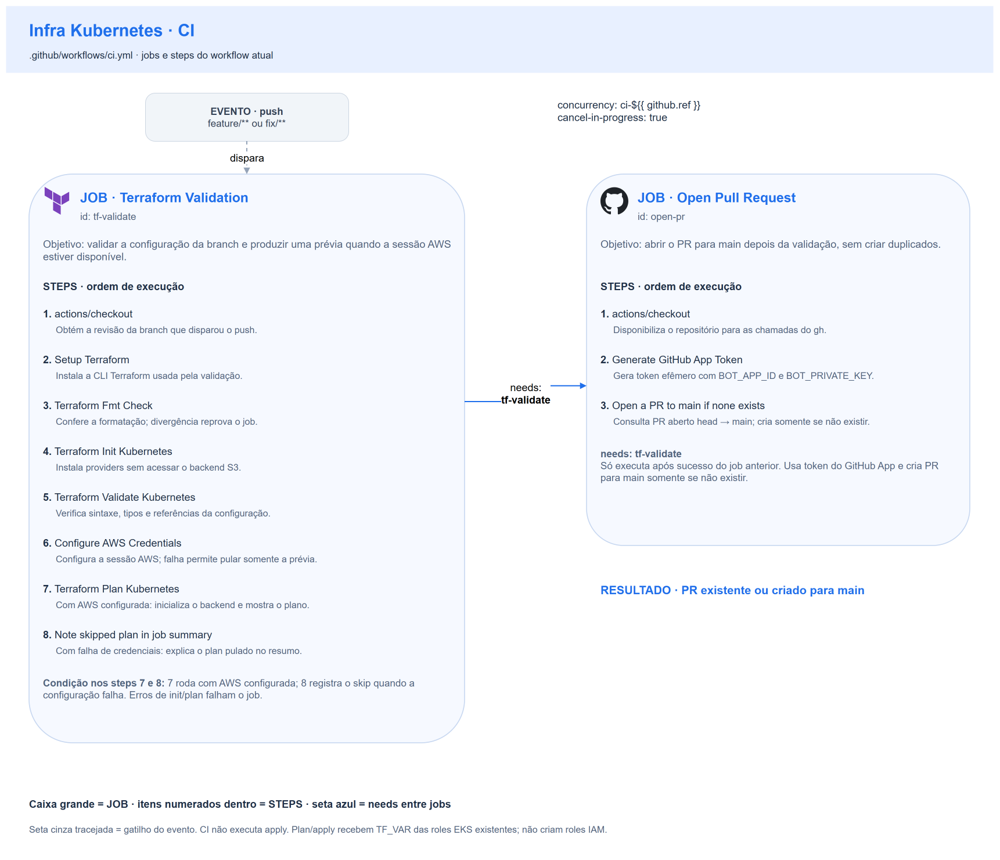
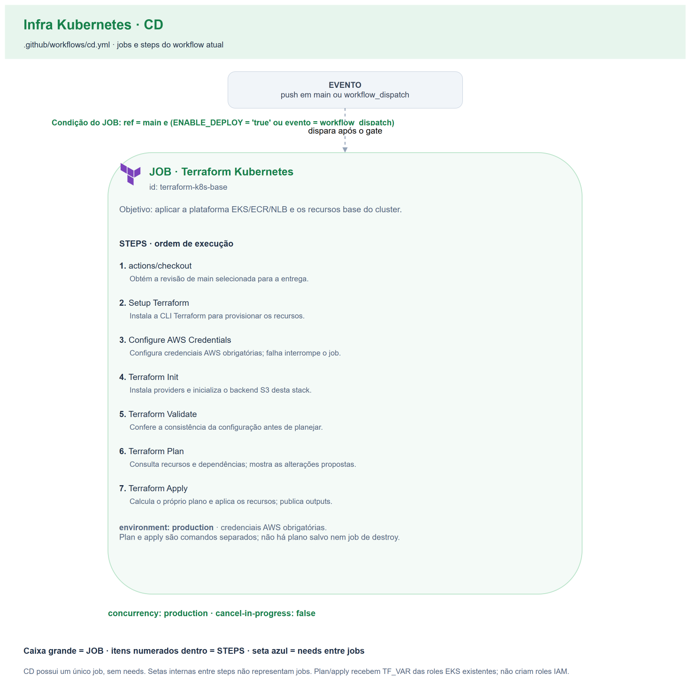

# 🔄 CI/CD — Plataforma Kubernetes

Dois workflows do GitHub Actions, um por responsabilidade: validar a branch e
abrir PR (**CI**), ou aplicar a infraestrutura (**CD**). A fonte executável é
[ci.yml](../.github/workflows/ci.yml) e [cd.yml](../.github/workflows/cd.yml).

## Índice

- [Fluxo de branch e Pull Request](#fluxo-de-branch-e-pull-request)
- [Concorrência, permissões e ambiente](#concorrência-permissões-e-ambiente)
- [1) Workflow de CI](#1-workflow-de-ci)
- [2) Workflow de CD](#2-workflow-de-cd)
- [Secrets e Variables](#secrets-e-variables)
- [Limites da validação e ciclo do laboratório](#limites-da-validação-e-ciclo-do-laboratório)

| Workflow | Arquivo | Gatilho | Responsabilidade |
| --- | --- | --- | --- |
| CI | `ci.yml` | `push` em `feature/**` e `fix/**` | fmt/init estático/validate; plan quando autenticação AWS estiver disponível; abertura idempotente de PR para `main` |
| CD | `cd.yml` | `push` em `main` ou `workflow_dispatch` | init/validate/plan/apply da infraestrutura, com gate por branch e variável de deploy |

**Como ler os diagramas:** cada caixa grande é um **job**; seus **steps** estão
enumerados dentro dela, na ordem do YAML. A seta entre jobs indica `needs`.
Gatilho e resultado são eventos, não jobs. Os desenhos de CI e CD são separados:
não há `workflow_run` nem dependência `needs` entre os dois workflows.

## Fluxo de branch e Pull Request

O CI roda a cada push em uma branch `feature/**` ou `fix/**`. Primeiro executa
`tf-validate`; se o job passar, `open-pr` consulta PRs abertos da mesma branch
para `main`. Se já existir um, termina sem duplicá-lo; senão, abre o PR.

Não há gatilho `pull_request` neste CI. Um novo push numa branch com PR aberto
reexecuta a validação e mantém o mesmo PR. A automação usa um token efêmero de
**GitHub App**, que precisa estar instalado com acesso ao repositório. O token
é gerado a partir da Variable `BOT_APP_ID` e do Secret `BOT_PRIVATE_KEY`.

## Concorrência, permissões e ambiente

| Workflow | Grupo | `cancel-in-progress` | Efeito |
| --- | --- | --- | --- |
| CI | `ci-${{ github.ref }}` | `true` | Um novo push cancela o run anterior da mesma ref, evitando validar uma revisão já substituída |
| CD | `production` | `false` | Não interrompe um apply em andamento; a entrega seguinte aguarda a concorrência do grupo |

O grupo tem escopo neste repositório. Sem fila adicional, um novo run substitui o pendente anterior; `cancel-in-progress: false` preserva o que já está executando. Ver [concorrência no GitHub Actions](https://docs.github.com/en/actions/how-tos/write-workflows/choose-when-workflows-run/control-workflow-concurrency).

Os jobs usam `ubuntu-latest`. O CI define `permissions: contents: read`; o
`open-pr` mantém essa permissão para checkout, mas usa o token do App para as
chamadas de PR. O App precisa de leitura de Contents e escrita de Pull Requests;
as permissões do `GITHUB_TOKEN` não ampliam as do App.

O único job de CD usa `environment: production`, `contents: read` e a condition:

```yaml
github.ref == 'refs/heads/main' &&
(vars.ENABLE_DEPLOY == 'true' || github.event_name == 'workflow_dispatch')
```

Assim, deploy automático exige o valor literal `true` em `ENABLE_DEPLOY`.
O disparo manual pode aplicar com a variável desligada, **mas também precisa
selecionar `main`**. Uma execução manual em outra branch pula o job. A
documentação não pressupõe novos required reviewers no environment.

## 1) Workflow de CI



| Job | Nome exibido | `needs` | Responsabilidade |
| --- | --- | --- | --- |
| `tf-validate` | Terraform Validation | — | Validação estática e preview condicionado à autenticação AWS |
| `open-pr` | Open Pull Request | `tf-validate` | Gerar token do App e consultar/criar PR para `main` |

### Job `tf-validate` — Terraform Validation

Os steps executam em sequência no mesmo runner. Comandos Terraform usam
`working-directory: terraform`; cada action de terceiros é fixada por SHA
completo no YAML, com a versão correspondente registrada em comentário.

1. **Checkout** (`actions/checkout`): disponibiliza a revisão que disparou o
   push no runner. Sem ele, os comandos não teriam a configuração da branch.
2. **Setup Terraform** (`hashicorp/setup-terraform`): instala/configura a CLI
   Terraform usada pelos steps seguintes. As restrições de compatibilidade da
   configuração continuam definidas nos arquivos Terraform.
3. **Terraform Fmt Check**: executa `terraform fmt -check -recursive`. Verifica
   a formatação sem alterar arquivos; divergência de formato falha o job.
4. **Terraform Init Kubernetes**: executa `terraform init -backend=false -no-color`.
   Instala os providers, sem conectar ao backend S3. Ainda depende de registry
   ou cache disponível para instalar os pacotes.
5. **Terraform Validate Kubernetes**: executa `terraform validate -no-color`, verificando
   sintaxe, referências e consistência com os schemas dos providers. Falhas
   impedem os steps seguintes e a abertura do PR.
6. **Configure AWS Credentials** (`aws-actions/configure-aws-credentials`,
   `id: aws_creds`): usa os Secrets de access key, secret key e session token,
   com região `us-east-1`. Somente esse step tem `continue-on-error: true`;
   `steps.aws_creds.outcome` conserva o resultado real para decidir os próximos.
7. **Terraform Plan Kubernetes**: executa somente se
   `steps.aws_creds.outcome == 'success'`. Primeiro faz
   `terraform init -reconfigure -no-color` para habilitar o backend remoto;
   depois `terraform plan -no-color` consulta a AWS e os states necessários e
   mostra as mudanças propostas. Esse step injeta `TF_VAR_eks_cluster_role_name` e `TF_VAR_eks_node_role_name` a partir de `vars.EKS_CLUSTER_ROLE_NAME` e `vars.EKS_NODE_ROLE_NAME`. As roles devem existir e a infra-base precisa ter state acessível. Uma falha de init/plan nessa
   condição **falha o job**; a tolerância não cobre erros depois de autenticar.
8. **Note skipped plan in job summary**: executa somente se
   `steps.aws_creds.outcome == 'failure'`. Acrescenta ao `$GITHUB_STEP_SUMMARY`
   a informação de que o plan foi pulado, mantendo fmt/validate como evidência
   estática e pedindo nova execução quando o ambiente estiver disponível.

Os steps 7 e 8 são caminhos alternativos dentro de **um mesmo job**, não jobs
paralelos. Com autenticação indisponível e validações estáticas aprovadas, o job
pode passar sem um plan. Isso não comprova a viabilidade do provisionamento.

### Job `open-pr` — Open Pull Request

`needs: [tf-validate]` faz esse job aguardar o sucesso do anterior. Se fmt,
validate ou um plan executado falhar, `open-pr` não roda.

1. **Checkout**: disponibiliza o repositório ao `gh`, permitindo identificar
   a origem e trabalhar no contexto do projeto.
2. **Generate GitHub App Token** (`actions/create-github-app-token`,
   `id: app_token`): recebe `vars.BOT_APP_ID` e `secrets.BOT_PRIVATE_KEY` e
   produz o token efêmero. O step seguinte o recebe como `GH_TOKEN`; não usa PAT.
3. **Open a PR to main if none exists**: define `HEAD_BRANCH` com `github.ref_name` e `ACTOR`
   com `github.actor`, e usa `set -euo pipefail`. Consulta
   `gh pr list --head "$HEAD_BRANCH" --base main --state open --json number
   --jq 'length'`. Com qualquer PR aberto, sai com sucesso sem criar outro.
   Caso contrário, `gh pr create` usa `--base main`, a branch head como título
   e um corpo que atribui a abertura automática ao ator do push. Erros do `gh`
   falham o job; não há fallback de autenticação nem retry definido no script.

## 2) Workflow de CD



| Job | Nome exibido | `needs` | Ambiente |
| --- | --- | --- | --- |
| `terraform-k8s-base` | Terraform Kubernetes | — | `production` |

Existe **um job**, com sete steps sequenciais. Não há jobs separados de plan
e apply nem dependência com um job de CI. O gate por `main`/`ENABLE_DEPLOY`/
manual é avaliado no job inteiro antes desses steps.

### Job `terraform-k8s-base` — Terraform Kubernetes

1. **Checkout**: obtém a revisão de `main` selecionada pelo evento/disparo.
2. **Setup Terraform**: instala/configura Terraform no runner.
3. **Configure AWS Credentials**: configura os três Secrets temporários e
   `us-east-1`. Aqui **não** há `continue-on-error`; credenciais ausentes ou
   inválidas impedem a inicialização e o apply.
4. **Terraform Init**: executa `terraform init -no-color` em `terraform/`.
   Instala providers e inicializa o backend S3 configurado para esta stack;
   o bucket precisa existir e ser acessível.
5. **Terraform Validate**: executa `terraform validate -no-color` antes do
   plan. O CD não inclui um step de fmt; a formatação pertence ao CI.
6. **Terraform Plan**: executa `terraform plan -no-color`, exibindo as
   alterações para a infraestrutura e consultando as dependências remotas.
   Injeta as mesmas duas Variables como `TF_VAR_eks_cluster_role_name` e `TF_VAR_eks_node_role_name`; não cria as roles IAM.
7. **Terraform Apply**: executa `terraform apply -auto-approve -no-color`.
   Repete a injeção dos nomes das roles e aplica EKS, node group, logs/SG, ECR, NLB, namespace e Metrics Server opcional. Não há arquivo de plano salvo por `-out`: o apply calcula
   seu próprio plano, em vez de reaplicar um artifact do step anterior.

Uma falha interrompe a sequência e falha o job. Não há upload de artifact de
plano, etapa de destroy, migration ou deploy da aplicação nesse workflow.
`TF_IN_AUTOMATION=true` é definido no CD para o uso automatizado da CLI.

O apply instala recursos de plataforma Kubernetes/Helm, mas não faz build da API nem deploy dos seus workloads. Os providers Kubernetes/Helm autenticam no EKS com token temporário, endpoint e CA; a duração da operação e a autorização no cluster continuam relevantes.

## Secrets e Variables

Configure os nomes abaixo em **Settings → Secrets and variables → Actions**,
nos tipos corretos, conforme o nível de repo/organização/environment usado pela
equipe. Ambos os workflows fixam `AWS_REGION=us-east-1`.

| Tipo | Nome | Usado em | Finalidade |
| --- | --- | --- | --- |
| Secret | `AWS_ACCESS_KEY_ID` | CI e CD | Access key temporária do laboratório |
| Secret | `AWS_SECRET_ACCESS_KEY` | CI e CD | Secret key da mesma sessão |
| Secret | `AWS_SESSION_TOKEN` | CI e CD | Token temporário; deve corresponder às outras duas credenciais |
| Variable | `BOT_APP_ID` | CI, `Generate GitHub App Token` | ID do App instalado no repositório |
| Secret | `BOT_PRIVATE_KEY` | CI, `Generate GitHub App Token` | Chave privada do App |
| Variable | `ENABLE_DEPLOY` | Condition do job de CD | `true` habilita deploy automático; manual ainda exige `main` |
| Variable | `EKS_CLUSTER_ROLE_NAME` | Plan do CI; plan/apply do CD | Nome da role IAM existente para o cluster |
| Variable | `EKS_NODE_ROLE_NAME` | Plan do CI; plan/apply do CD | Nome da role IAM existente para os nodes |

As Variables do GitHub só são injetadas onde o YAML as referencia; não viram
automaticamente inputs de uma execução local. A região dos recursos localmente
vem de `aws_region`; mudar região exige conferir também backend, states e
workflows, não apenas o input.

## Limites da validação e ciclo do laboratório

- `fmt`, init sem backend e `validate` são validações estáticas; não confirmam permissões, conectividade ou um plan de infraestrutura.
- O plan do CI pode ser pulado quando **a configuração de credenciais falha**. Depois de autenticar, indisponibilidade de state, recurso ou API durante o plan falha o job.
- O job combinado `Terraform Validation` continua opcional nos required checks, conforme a decisão para o AWS Academy. Não foi criado um novo gate de reviewers em `production`.
- Não há workflow de destroy. A ordem de provisionamento/destruição e os custos do componente estão em [Como Executar Localmente](../README.md#-como-executar-localmente).
- Logs do run e `$GITHUB_STEP_SUMMARY` mostram quais steps efetivamente executaram; a existência desta documentação não comprova um run cloud.

Decisões relacionadas: [ADR 0002 — Amazon EKS](adr/0002-eks-como-distribuicao-gerenciada.md), [ADR 0005 — Autenticação dos providers](adr/0005-auth-providers-k8s-helm-via-token-iam-efemero.md) e [ADR 0003 de infra-base — Tolerância do CI às credenciais](https://github.com/FIAP-15SOAT/oficina-mecanica-infra-base/blob/main/docs/adr/0003-ci-tolerante-a-indisponibilidade-do-lab.md).

Voltar ao [README](../README.md).
